# houdini_hda_collection

Houdini Digital Assets Collection

## fake_window (VOP: Fake Window)

A shader similar to Unity's Fake Window. Outputs a simple color from the perspective camera.

|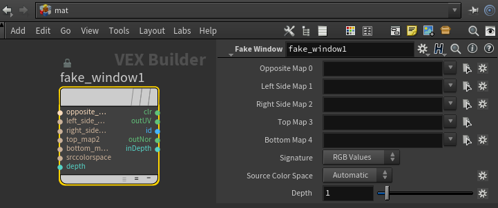|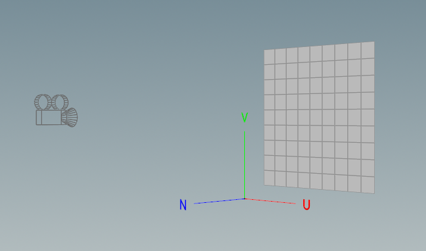|
|:---:|:---:|
|Vop in MatNetwork|Pre-set: UV and Normal|

* Depth: Maximum depth value when outputting inDepth.
* Outputs:

    |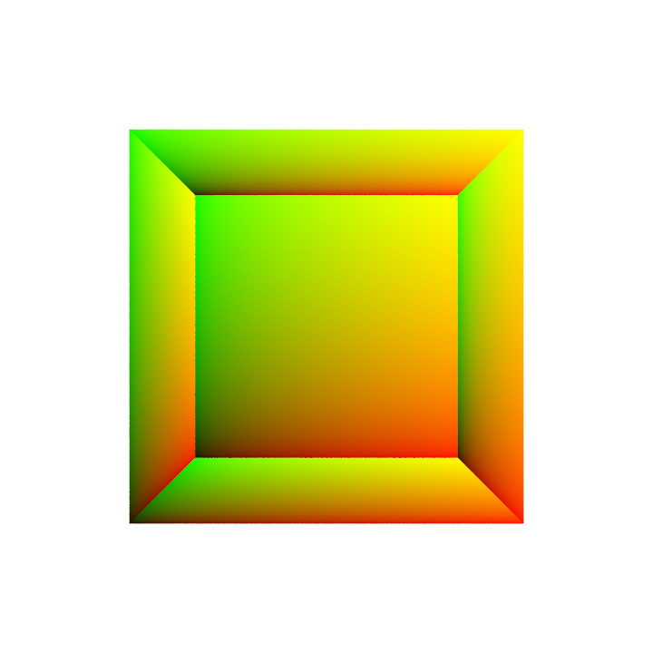|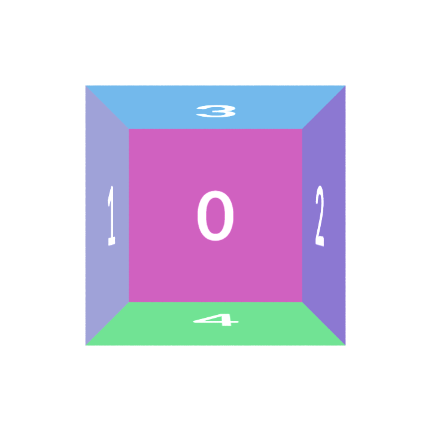|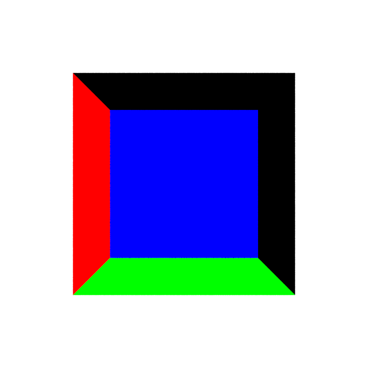||
    |:---:|:---:|:---:|:---:|
    |outUV|id|outNor|inDepth|

## grid_cutter (SOP: Grid Cutter)

|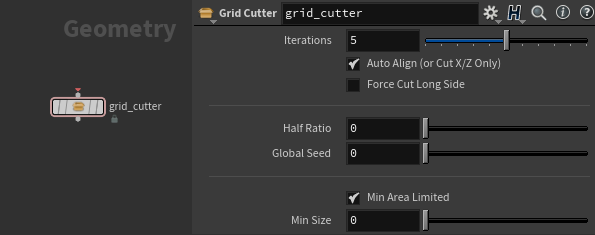|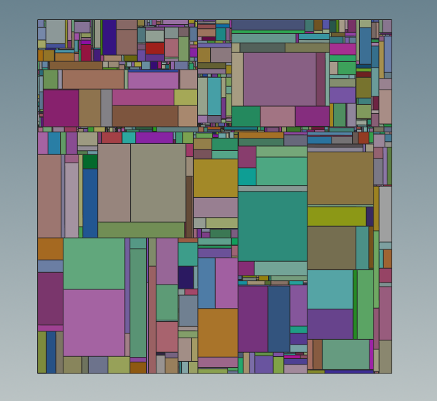|
|---|---|

* Auto Align: Aligns the face to the X/Z plane before cutting. (Useful when using grid_cutter in a For-Each Primitive loop.)
  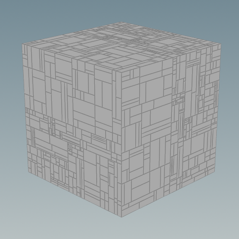
* Force Cut Long Side: Cuts the longer side at each iteration.
  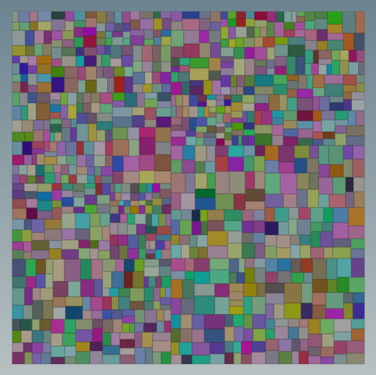
* Half Ratio: How close each cut is to the halfway point.

  | 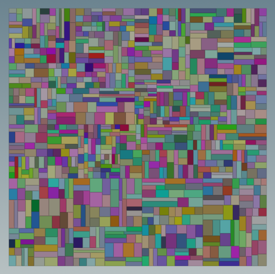|   |
  |:----:|:----:|
  | Half Ratio: 0.5 | Half Ratio: 1 |

* Min Size: Limits the size of the smallest piece.

## line_cracker (SOP: Line Cracker)

Fractures based on polyline projection (X/Z plane).

|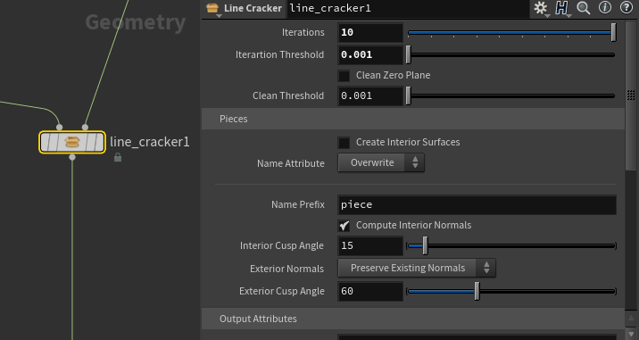|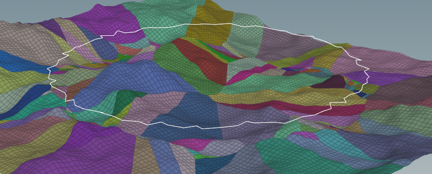|
|---|---|

> Input 1: polyline.  
> Input 2: Ground plane (does not need to be flat)  
> Output: Fractured polygons with attributes.

|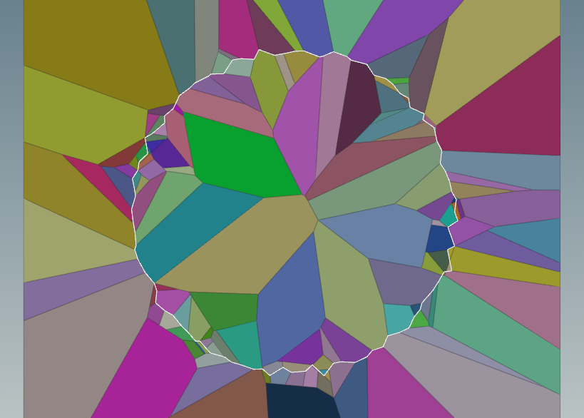|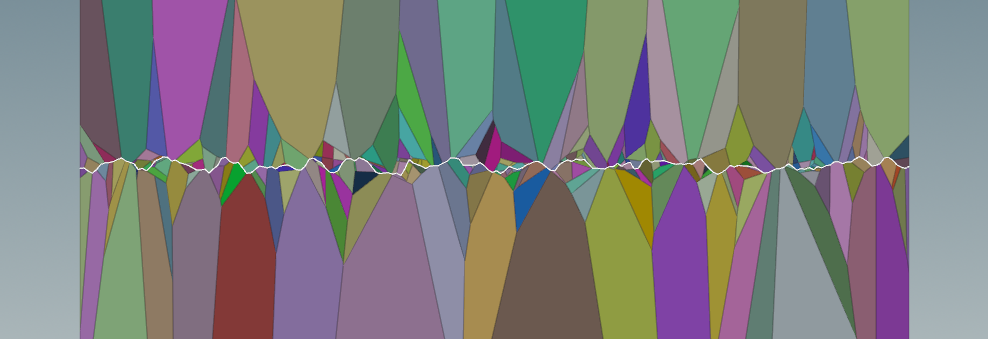|
|:---:|:---:|
|Close Line|Open Line|

* Iterations: Increase to better match the input line. (May not be a perfect match.)
* Iteration Threshold: Avoids extremely small pieces.

## export_Maya_nParticles_cache (SOP: Export Maya nParticle cache)  

*Export Maya nParticle cache directly from Houdini.*

REQUIREMENT:  

1. Unique id attribute.
2. [Source code: nCache.py](https://github.com/chordee/mayaGeoCache)

Attribute Mapping:  

```
v@v -> velocity
f@age -> age
f@life -> lifespanPP
f@pscale -> radiusPP
v@Cd -> rgbPP
f@Alpha -> opacityPP
v@rotation -> rotationPP
```

  

* Start Frame
* End Frame
* Evaluation Rate
* XML: xml file path to be written.
* Particle Name: Name of the particle shape in Maya.
* Python Module Path: File path to [nCache.py](https://github.com/chordee/mayaGeoCache/blob/master/nCache.py).

---

## export_Maya_geoCache (SOP: Export Maya geoCache)  

*Export Maya geometry point cache directly from Houdini. (Multiple objects are supported.)*

REQUIREMENT:  

1. Primitive attribute: path
2. [Source code: nCache.py](https://github.com/chordee/mayaGeoCache)

> The path attribute defines the target in Maya. The recommended workflow is to use an Alembic file exported from Maya, preserving the path attribute for exporting back.

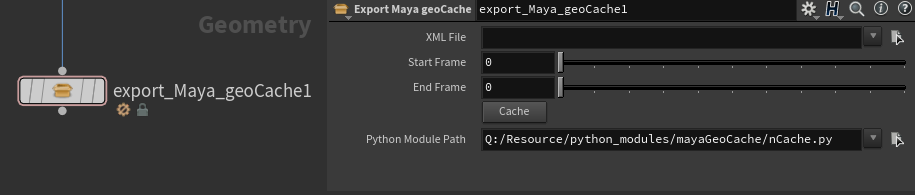

* XML: Path to the XML file to be written.
* Start Frame
* End Frame
* Python Module Path: File path to [nCache.py](https://github.com/chordee/mayaGeoCache/blob/master/nCache.py).

---

## Mandelbrot3D (VOP)

[Entagma - VEX in Houdini: Mandelbrot and Mandelbulb](https://vimeo.com/176911687)  

[Zeus VFX - 3D Fractal in Houdini Tutorial](https://youtu.be/-qgtQ91oItQ)  
  
  

## volume_texture (VOP: Volume Texture)  

Reuse the volume texture exported from **Labs Volume Texture Export** in Houdini.
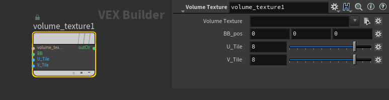

* Volume Texture: Texture filepath.
* BB_pos: Bounding box position.
* U_Tile
* V_Tile
* outClr: RGB color from the volume texture.

## create_crowd_collections_by_agent_stage_material (LOP)

Create collections based on the material binding name of the source agent mesh.
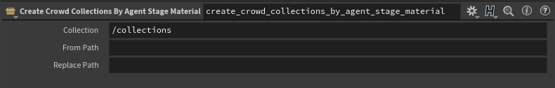

* Collection: collection prim path
* From Path
* Replace Path

## thunder_builder (SOP: Thunder Builder)
